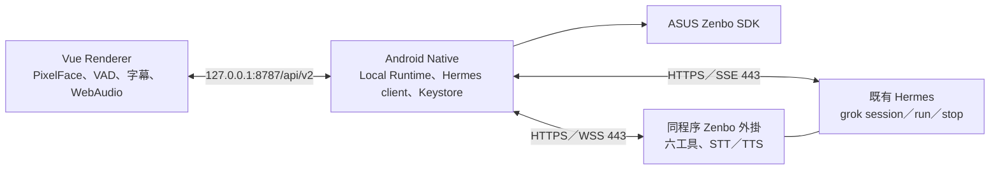

# Zenbo LLM Agent — Hermes grok

Zenbo K 的 Android Launcher 與語音／表情介面，使用既有 **Hermes grok Profile**
管理 Agent、session 與 run。本分支把自建 Gateway 改成 Native 直接使用 Hermes API；
六項裝置工具及語音透過同一個 Hermes 程序內的 Zenbo 外掛提供，不另外部署 Gateway 或資料庫。

[完整核准計畫](docs/implementation/hermes-grok-plan.md) ·
[Hermes／外掛契約](contracts/hermes-zenbo/README.md) ·
[本機介面](contracts/local-runtime/README.md)

## 架構



- Web 只連 loopback；一次性 URL fragment token 交換成 HttpOnly session cookie。
- Native 管理 Hermes API key、TLS、管理 PIN、機器人安全檢查、音檔驗證及本機事件序號。
- API key 使用 Android Keystore 保護，不進 Pinia、localStorage、Web assets 或 APK。
- Hermes 管理模型與語音 provider；裝置只保存 Hermes 存取 key。
- Android 6／API 23 是相容性與實機測試基準；桌面、JVM 或 APK build 通過不代表實機驗收通過。

保留 PixelFace 五種表情、實際音量嘴型、語音字幕、休眠喚醒及點臉／頭部按鍵中斷。
表情在回答第一段音訊開始播放時切換，多段音訊依序播放，最後一段播畢才結束回合。
播放時仍暫停 VAD；免觸碰語音插話不在本次範圍。

## 固定 Hermes Profile

```text
OPENAI_BASE_URL=https://hermes.internal.c3land.org/hermes-api/p/grok/v1
OPENAI_API_KEY=從 secret/OPENAI_API_KEY 讀取
```

`OPENAI_*` 是本機測試及操作使用的名稱；Android 設定 API 使用 `gatewayUrl`、
write-only `apiKey`。不要把 shell 變數注入 Vite 或 APK。既有本機 key 若仍名為
`secret/HERMES_API_KEY`，測試工具可明確指定此檔案；文件預設名稱為 `OPENAI_API_KEY`。

請求保留完整 grok Profile 路徑：

| 功能 | 公開路徑 |
| --- | --- |
| Sessions | `/hermes-api/p/grok/api/sessions` |
| Runs／SSE／取消 | `/hermes-api/p/grok/v1/runs` |
| 裝置通道、語音 | `/hermes-api/zenbo/grok/v1` |

所有公開連線使用 HTTPS／WSS 443。錯誤 Profile、key 或外掛缺失會明確失敗，不退回預設
Hermes Profile。模型與既有可用 STT／TTS 由該 Profile 自動管理；裝置不選模型，Runs 請求省略 `model`。Hermes 原生 `audio_api=false` 不代表外掛語音已失敗；須另外檢查外掛
capabilities 與實際 STT／TTS。服務健康檢查也不等於完整語音與六工具已驗收。

## 開發與測試

前置條件：Node `^20.19.0 || >=22.12.0`、JDK 17、Android SDK Platforms 34／36、
Platform-Tools（ADB），以及與目標裝置相容的 ASUS SDK JAR。依
[SDK 說明](android/ZenboSDK/README.md) 放到
`android/ZenboSDK/.local/ZenboJuniorSDK.jar`，或傳入 `-PzenboSdkJar=/absolute/path/to/sdk.jar`。
Vendor JAR、下載工具、錄音及 secrets 不納入 Git。

```sh
npm ci
npm test
npm run test:contracts
npm run test:hermes
npm run build
npm run android
cd android
./gradlew :RobotActivityLibrary:testDebugUnitTest :KiraZenbo:testDebugUnitTest
./gradlew :KiraZenbo:assembleDebug
```

`npm run dev` 啟動 UI 開發；`npm run android:watch` 持續更新 Android 內嵌 Web assets。
`test:hermes` 使用 recorded fixtures 和離線邊界案例，不會使用正式 key。
Python 外掛測試與安装方式由 [外掛文件](integrations/hermes-zenbo/README.md) 說明。
更新 Web runtime dependency 時執行 `npm run licenses:web` 並更新授權清單。

## 裝置設定與 USB 驗收

1. `adb devices -l` 確認 USB 授權，讀取 `ro.build.version.sdk`、`ro.product.model`、
   `ro.build.fingerprint` 與 `ro.product.cpu.abilist`。以實際 ABI 選 APK。
2. 首次安裝或覆蓋安裝前確認現有 App 與資料；已有設定先保留，使用 `adb install -r`。
   若簽章衝突，先處理備份與簽章，不直接 uninstall 清空資料。
3. App 首次設定輸入完整 grok URL、Hermes API key、6–12 位管理 PIN
   與確認值。先測試連線／TLS，再原子化保存。key 留白更新時保留既有 key，UI 不讀回密文。
4. 平常長按設定齒輪開啟設定，使用 PIN 解鎖。優先用 `SYSTEM_TRUST`；若使用
   `CONFIRMED_SPKI_PIN`，先經可信管道核對 SPKI 指紋。未確認前只探測憑證，不傳 key。
5. 先測文字與表情，再測中文 WAV、長回答與多段播放、取消／重連／重啟，最後在安全空間測
   `look_at_user`、跟隨與停止。詳細項目見 [驗收清單](docs/implementation/acceptance.md)。

本機協定與設定改為 v2，舊 Gateway 設定不會被靜默當作 Hermes 設定使用。
每個裝置同時只有一個 active run；取消先在本機停止，Hermes 尚未結束時新回合回傳
`TURN_BUSY`，避免舊工具跑到新回合。

按 Home 後可選 Kira；完成實機驗收前保留原廠 Launcher。要復原可進入系統 Home app 設定，
或 `adb shell am start -a android.settings.HOME_SETTINGS`（依韌體支援）。不要停用原廠 Launcher。

## 目錄與交付界線

| 目錄 | 用途 |
| --- | --- |
| `src/` | Vue Renderer 與 Local Runtime transport |
| `android/KiraZenbo/` | Native Hermes client、Launcher、Local Runtime |
| `android/RobotActivityLibrary/` | ASUS SDK adapter |
| `integrations/hermes-zenbo/` | 部署到既有 Hermes 程序的 Zenbo 外掛 |
| `contracts/hermes-zenbo/` | 六工具共用 schema 與外掛 wire contract |
| `contracts/local-runtime/` | Native → Renderer v2 契約 |
| `tests/hermes/` | Hermes recorded fixtures 與離線測試 |
| `docs/implementation/` | 計畫、操作與驗收記錄 |

自建 Agent Gateway 1.0 契約、舊 Fake Gateway 及其 `test:gateway` 已淘汰。測試替身不是
正式服務。最終狀態須分別記錄「source/build」、「實際 Hermes」、「指定 Zenbo 韌體」的證據，
不得把尚未部署外掛或尚未完成硬體驗收標記為可用。

## 授權

原始碼採 [Apache-2.0](LICENSE)。請保留
[Third-party notices](THIRD_PARTY_NOTICES.md)、[Web licenses](WEB_THIRD_PARTY_LICENSES.txt)
及 [Android NOTICE](android/NOTICE)。ASUS SDK binary 不在本專案授權範圍；不得 commit 或重新散布。
