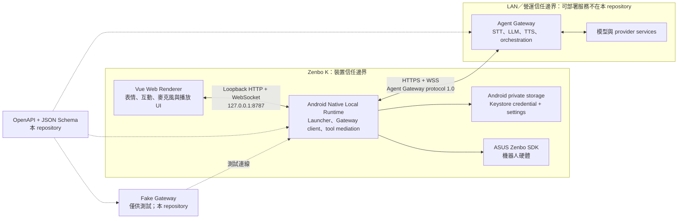

# Zenbo LLM Agent

Zenbo LLM Agent 是以 Zenbo K 為目標的替代 Launcher／互動介面。這個 repository 採用 **Thin Client + LAN Agent Gateway**：Zenbo 上只保留 Web 表情與互動 UI、Android 裝置整合、安全憑證儲存及機器人動作；STT、LLM、TTS 與 agent orchestration 由區域網路內另一台主機上的 Agent Gateway 負責。

> 目前 repository 內的 Web、Android、protocol contracts 與 Fake Gateway 都已有實作和測試；目標 Zenbo K 的 CPU ABI、韌體相容性、ASUS SDK 行為及完整語音／動作流程仍待實機驗證。請勿把目前的 APK 視為已通過特定 Zenbo K 型號的發行版。

## 架構與安全邊界



主要安全邊界如下：

- Web Renderer 只連 `http://127.0.0.1:8787` 的 Native Local Runtime，不持有 Gateway token，也不直接連 Agent Gateway 或模型 provider。啟動時的一次性 fragment token 會交換成 `HttpOnly` session cookie。
- Native 負責 HTTPS／WSS、TLS trust、裝置 token、管理 PIN、tool allowlist、回應 artifact 驗證，以及 ASUS SDK／硬體操作的仲介。
- 裝置 token 以 Android Keystore 支援的 AES-GCM 儲存；管理 PIN 只保存加鹽 verifier，PIN 本身不落盤。這也是應用最低支援 Android API 23 的原因之一。
- 遠端 Gateway URL 必須使用 `https://`；cleartext 只開放給裝置內 loopback Local Runtime。
- 模型／provider API key 只應存在 repository 外的 Agent Gateway 環境。APK、Web bundle 與瀏覽器儲存都不應包含這些金鑰。

## Repository 範圍

本 repository 包含：

- Vue 3 Web Renderer：豐富表情、語音互動狀態與設定 UI。
- Android `KiraZenbo`：GeckoView wrapper、HOME Launcher、Local Runtime、Agent Gateway client、憑證與機器人整合。
- Agent Gateway 1.0 與 Local Runtime 的 OpenAPI／JSON Schema contracts。
- dependency-free、記憶體內的 Fake Gateway，供 contract 與 Native 整合測試使用。

本 repository **不包含**：

- 可部署、可供正式環境使用的 Agent Gateway。
- LiteLLM compose、STT／TTS／模型服務的部署設定。
- 任何 provider `.env`、provider API key 或正式環境 secret。

## 實作狀態

| 區塊 | 目前狀態 | 驗證界線 |
| --- | --- | --- |
| Web Renderer | 已實作 Vue UI、表情／語音狀態、設定與 Local Runtime transport | 有 Vitest 與 Vite build；實機螢幕、麥克風及播放仍待驗 |
| Android Thin Client | 已實作 Launcher、Local Runtime、Gateway client、TLS trust、credential store 與 tool mediation | 有 JVM unit tests；Zenbo K 韌體／SDK／硬體行為仍待實機驗證 |
| Protocol contracts | Agent Gateway 1.0 OpenAPI／schemas 與 Local Runtime OpenAPI 已納入 | 有獨立 contract validator |
| Fake Gateway | HTTP／WebSocket lifecycle、可選 TLS／WSS、fixture token 與 artifact 流程已實作 | 有 Node integration tests；僅供測試，不是正式 Gateway |
| Deployable Agent Gateway | 不在本 repository | 必須由部署端依 contracts 另行實作 |

## 目錄

```text
src/                                  Vue 3 Web Renderer
public/vad/                           瀏覽器端 VAD 靜態資產
android/KiraZenbo/                    Android Launcher 與 Native Local Runtime
android/RobotActivityLibrary/         ASUS Zenbo SDK adapter library
android/ZenboSDK/                     本機 vendor SDK 放置說明（不含 SDK binary）
contracts/agent-gateway/              Agent Gateway 1.0 OpenAPI 與 JSON Schema
contracts/local-runtime/              Web Renderer ↔ Native Local Runtime OpenAPI
tests/contracts/                      Contract validator
tests/fake-gateway/                   測試用 Fake Gateway 與 integration tests
scripts/generate-third-party-licenses.mjs
```

## 開發前置條件

- Node.js `^20.19.0` 或 `>=22.12.0`，以及 npm。
- JDK 17。Android app 的 Java compatibility 為 11，但 Gradle toolchain 需要 JDK 17。
- Android SDK Platform 34、Platform 36，以及 Android SDK Platform-Tools（`adb`）。應用的 `minSdkVersion` 是 23，主 app 的 `targetSdkVersion` 是 36。
- 與目標 Zenbo K 及其韌體相容的 ASUS Zenbo SDK JAR。SDK 是 ASUS 的專有相依套件，不由本 repository 散布。

先依 [ASUS Zenbo SDK prerequisite](android/ZenboSDK/README.md) 接受適用的 vendor license，並將 JAR 放在：

```text
android/ZenboSDK/.local/ZenboJuniorSDK.jar
```

檔名是目前 Gradle 的本機預設路徑，不代表不同 Zenbo 世代的 SDK binary 可以互換。也可以在 Gradle 命令加上 `-PzenboSdkJar=/absolute/path/to/compatible-sdk.jar` 覆寫位置。請勿 commit 或重新散布 vendor JAR。

## Build 與測試

安裝依賴並啟動 Web 開發環境：

```sh
npm ci
npm run dev
```

Repository 的 Web、contract、Fake Gateway 測試與 production Web build：

```sh
npm test
npm run test:contracts
npm run test:gateway
npm run build
```

更新 Web 第三方授權清單時執行：

```sh
npm run licenses:web
```

建置 Android 前，先把 Web assets 輸出到 app assets，再執行 Android unit tests 與 debug APK build：

```sh
npm run android
cd android
./gradlew :RobotActivityLibrary:testDebugUnitTest :KiraZenbo:testDebugUnitTest
./gradlew :KiraZenbo:assembleDebug
```

Windows 請將 `./gradlew` 換成 `gradlew.bat`。持續同步 Web assets 時可在 repository root 使用 `npm run android:watch`。

## Agent Gateway onboarding

1. 在 LAN 主機準備實作 [Agent Gateway 1.0 contract](contracts/agent-gateway/) 的 HTTPS／WSS 服務，為這台裝置核發專用 device token。正式 Gateway 與 provider secrets 不放在本 repository。
2. 將 APK 安裝到 Zenbo，第一次啟動會進入設定流程。之後若要重開設定，長按右上角齒輪約 2 秒。
3. 輸入 `https://` Gateway URL、device token、6–12 位數字的管理 PIN 與確認值、TLS trust mode、Agent profile、Robot name 和語言。
4. 先測試 Gateway 與憑證，再執行「設定 PIN 並啟用」。第一次 setup 會將 PIN、Gateway、token、trust mode、profile 與互動 context 原子化保存；失敗時不應留下半套 onboarding 狀態。
5. 日後測試或修改設定都要先用管理 PIN 解鎖。Device token 欄位留白會保留既有 token，且 UI 不會從 Native 讀回 secret。

Resume／sleep 的狀態轉換由 client state machine 以固定行為管理，不是 onboarding 或 operator settings 的可調欄位。

### `SYSTEM_TRUST`

此模式使用 Android 平台 trust store。Gateway 憑證鏈必須終止於裝置信任的 CA，且 SAN 必須符合 Gateway URL 的 hostname 或 IP。

設定頁的 Gateway Test 可以用這次輸入的 transient device token 驗證 capabilities；測試本身不會保存 token。只有完成 setup／save 後，token 才會寫入 Native credential store。

### `CONFIRMED_SPKI_PIN`

此模式仍要求 Gateway URL 的 hostname／IP 與憑證 SAN 相符，但以人工確認的 `sha256/<base64>` SPKI fingerprint 固定公鑰：

1. 先按「測試 Gateway」。未確認 pin 前，Native 只做 certificate probe，**不會送出 device token**。
2. 用 Gateway 主機或其他可信的 out-of-band 管道核對畫面顯示的 SPKI fingerprint；不要只相信同一個未驗證連線回報的值。
3. 確認畫面上的 fingerprint，讓 `certificatePin` 與 `confirmedFingerprint` 完全一致，再儲存設定。
4. 後續 authenticated capabilities 與 session 流程才會使用 device token。

更換 Gateway 憑證／公鑰時必須重新核對並保存新的 fingerprint。

## 使用 Fake Gateway 測試 TLS

[Fake Gateway 操作說明](tests/fake-gateway/README.md) 是可執行的測試 harness。預設的 HTTP／WebSocket 模式只供 Node contract tests；Android Native 拒絕 cleartext Gateway URL，因此與裝置整合時必須提供 TLS certificate 與 key：

```sh
node tests/fake-gateway/server.mjs \
  --tls-cert /secure/outside-repo/zenbo-test-cert.pem \
  --tls-key /secure/outside-repo/zenbo-test-key.pem
```

USB 連線裝置可用 ADB reverse，讓 Fake Gateway 繼續只綁 loopback：

```sh
adb reverse tcp:8788 tcp:8788
```

接著將 Gateway URL 設為 `https://127.0.0.1:8788/agent/v1`。憑證 SAN 必須包含 `IP:127.0.0.1`；只有 Common Name 不足以通過驗證。若改用 LAN hostname／IP，請使用相符 SAN 的測試憑證、限制主機 firewall，並參考 Fake Gateway 文件的 `--host` 與 `--device-id` 選項。

Fake Gateway 的 `--device-id` 必須與該 Native installation 送出的 `X-Zenbo-Device-Id` 完全一致；設定 UI 不會顯示這個值。啟動 debug APK 至少一次後，可以用 `run-as` 只擷取 `device_id`，避免把整份 preferences（可能含 Gateway URL 或 certificate pin）印到終端：

```sh
adb exec-out run-as com.robot.asus.kira cat shared_prefs/agent_gateway_settings.xml \
  | sed -n 's/.*name="device_id">\([^<]*\)<.*/\1/p'
```

`run-as` 只適用於可偵錯 build；正式 enrollment 應由 Gateway 提供可稽核的 first-use binding／provisioning 流程，不應靠讀取 app-private files。

私鑰必須放在 repository 外並限制檔案權限，不可 commit。Fake Gateway 內建 token 是公開測試 fixture，不得用於正式或不受信任的網路。

## 安裝與替換 Launcher

先查詢裝置支援的 ABI；清單通常依偏好順序排列：

```sh
adb shell getprop ro.product.cpu.abilist
```

依結果選擇相符的 ABI-specific APK。例如清單第一個相容 ABI 是 `arm64-v8a` 時：

```sh
adb install -r android/KiraZenbo/build/outputs/apk/debug/KiraZenbo-arm64-v8a-debug.apk
```

若韌體沒有可靠回報 ABI，才將 universal APK 作為 fallback：

```sh
adb install -r android/KiraZenbo/build/outputs/apk/debug/KiraZenbo-universal-debug.apk
```

Universal debug APK 包含四組 native libraries，可能達數百 MiB，並可能受裝置剩餘空間、暫存空間或 package installer 大小上限影響；不要把它當成一般安裝的首選。

按下 Home 後，在 Android 的 Launcher 選擇畫面選擇 `Kira`，確認功能正常後才選「一律使用」。在實機驗證完成前，請保持原廠 Launcher 啟用，並保留 ADB recovery 路徑。

要恢復原廠 Launcher：

1. 開啟 Android 的 Home app／Default apps 設定，清除 `Kira` 的預設值。
2. 再按 Home，選回原廠 Launcher 並設為預設。
3. 若 UI 無法進入設定，可嘗試 `adb shell am start -a android.settings.HOME_SETTINGS`；不同韌體未必提供相同 settings activity。
4. 最後手段是透過 ADB 解除安裝 `Kira`，讓系統回到仍啟用的原廠 Home app。

不要停用或移除原廠 Launcher；否則 Kira 啟動失敗時可能失去可操作的 Home 畫面。

## ABI APK 與實機驗證

`:KiraZenbo:assembleDebug` 目前會輸出：

```text
KiraZenbo-armeabi-v7a-debug.apk
KiraZenbo-arm64-v8a-debug.apk
KiraZenbo-x86-debug.apk
KiraZenbo-x86_64-debug.apk
KiraZenbo-universal-debug.apk
```

- ABI-specific APK 較小，應先依 `adb shell getprop ro.product.cpu.abilist` 的結果選擇相符輸出。
- universal APK 包含 Gradle 設定的四種 ABI，只作為 ABI 無法可靠判斷時的 fallback；安裝前要先確認儲存與 installer 限制。
- 這些輸出只代表 build configuration；不能據此推斷特定 Zenbo K 的 CPU、韌體、GeckoView native library 或 ASUS SDK 一定相容。

發佈前至少要在目標 Zenbo K 實機驗證：冷啟動與 HOME 恢復、螢幕方向／解析度、麥克風權限與 VAD、TTS 播放、斷線重連、TLS trust 更新、每個 allowlisted robot tool，以及長時間運作的記憶體與溫度。

## Secrets 與設定原則

- 不要新增 provider `.env` 或把 provider credentials 打包到 client。這些只屬於 repository 外的 Gateway deployment。
- Device token 是 Gateway 核發給單一裝置的 credential，不是模型 provider API key；應可個別撤銷與輪替。
- 不要把真實 device token、TLS private key、未公開 hostname／IP、錄音或對話資料 commit 到 Git。
- Contract／Fake Gateway 中的 token、device ID 與 payload 都是公開測試 fixture，不得移作正式用途。

## License

本專案原始碼採 [Apache License 2.0](LICENSE)。Fork、修改與商業使用通常是友善的，但散布時仍須遵守 Apache-2.0 的 license、notice、修改標示及專利條款。

第三方與 Android bundle 的授權資訊請一併查看：

- [Third-party notices](THIRD_PARTY_NOTICES.md)
- [Web third-party licenses](WEB_THIRD_PARTY_LICENSES.txt)
- [Android NOTICE](android/NOTICE)
- [ASUS Zenbo SDK prerequisite and redistribution boundary](android/ZenboSDK/README.md)

Apache-2.0 **不會**替你授權 ASUS Zenbo SDK binary、模型、provider API 或其他第三方素材。取得、使用與重新散布這些項目時，仍須分別遵守其原廠條款。
